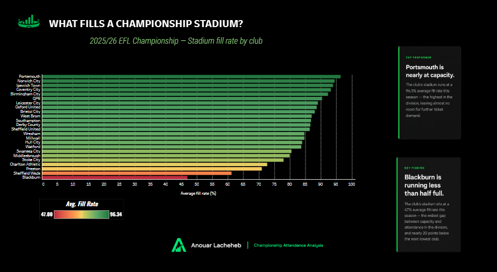
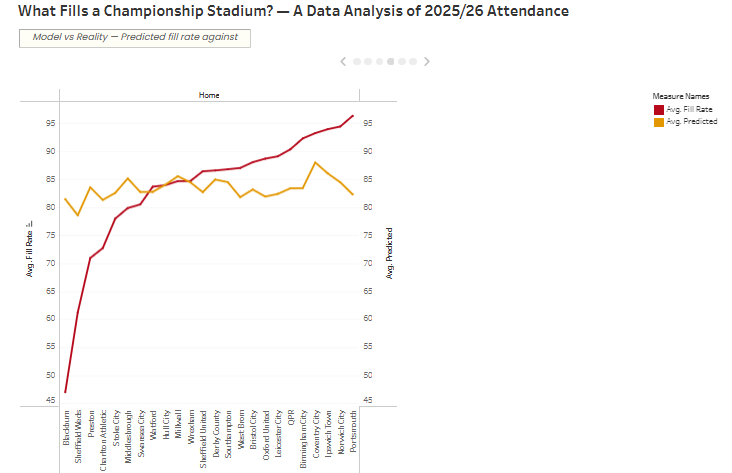
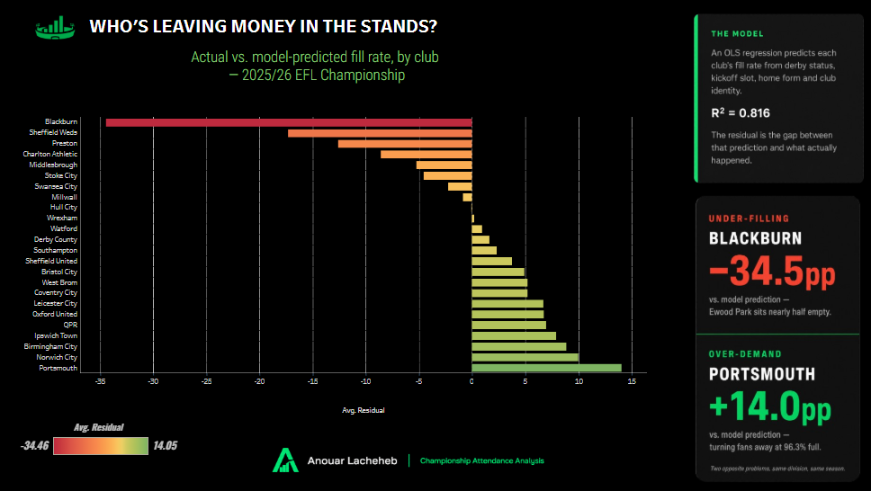
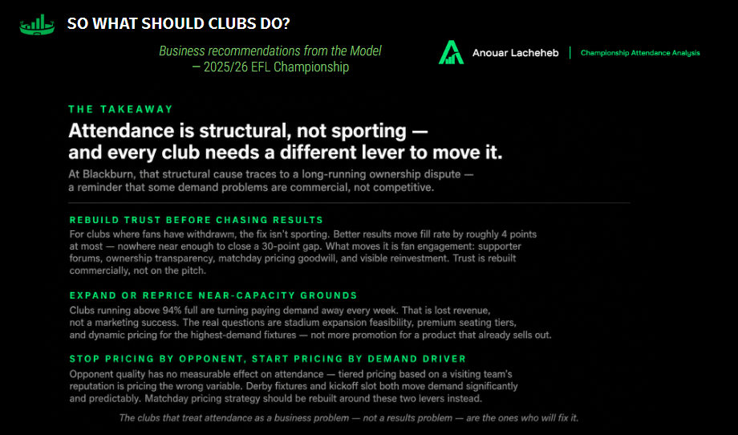

# What Fills a Championship Stadium? — 2025/26 Season

**Which clubs are leaving money in the stands — and why.**

> **Season scope:** 2025/26 EFL Championship regular season only — 552 matches, with play-offs excluded.

[**View the interactive 2025/26 Tableau report**]([https://public.tableau.com/app/profile/anouar.lacheheb/viz/WhatFillsaChampionshipStadium/WhatFillsaChampionshipStadium](https://public.tableau.com/app/profile/anouar.lacheheb/viz/AttendenceAnlysisEFL2526/AttendaceAnalysisEFL2526))


*Dashboard overview — 2025/26 EFL Championship season.*

---

## Project Overview

Championship clubs depend on matchday revenue in a way Premier League clubs do not. With a fraction of the top flight's broadcast income, an empty seat is money that never comes back.

This project models what drives stadium fill rates across all 552 matches of the 2025/26 EFL Championship season, then identifies which clubs under-fill relative to what their fixtures, kickoff slots and form would predict.

**Headline result:** Blackburn Rovers under-fill by 34.5 percentage points — roughly **10,800 empty seats per home match**. It is not the fixtures, the scheduling, the results, or the size of the stadium.

---

## Business Question

> **What actually fills a Championship stadium — and which clubs are leaving money in the stands?**

Supporting questions:

- Which factors measurably move attendance, and by how much?
- Once fixtures and scheduling are controlled for, which clubs still under-fill?
- Is under-filling a structural problem, or a fixable one?

---

## I Started With the Premier League. It Didn't Work.

The original plan was to model Premier League attendance. Before building anything, I calculated fill rates across the 2025/26 season.

**League-wide average fill rate: 97.9%.**

Premier League stadiums run essentially full. Season tickets lock demand in, and even the season's lowest attendance still filled the ground. There was almost no variation to explain, and therefore nothing to model.

**So I moved to the league where attendance is a genuine business problem.** Championship fill rates range from 47% to 96%. That variance is the project.



*Club-by-club stadium fill rates — 2025/26 EFL Championship.*

This is documented rather than hidden, because knowing when data cannot answer a question is part of the work.

---

## Data Sources

| Source | What It Provides | Records |
|--------|------------------|---------|
| FBref.com | Match results, attendance, kickoff day/time, venue | 552 matches |
| Wikipedia (2025–26 EFL Championship) | Stadium capacities | 24 clubs |
| Sky Sports | Independent verification of disputed attendances | — |

- **Season:** 2025/26 EFL Championship (8 Aug 2025 – 2 May 2026)
- **Coverage:** All 552 regular-season matches. Play-offs excluded — non-standard, high-stakes fixtures that sell out regardless of the factors under test, with the final at a neutral venue.
- **Missing attendance:** zero

---

## Data Validation

Every value that looked physically impossible was checked against a second source. Two cases arose, and they resolved differently — which is itself the point.

### Stoke City v West Bromwich Albion, 30 August 2025 — a genuine error

FBref reported **35,328**. That is 117% of the bet365 Stadium's 30,089 capacity, and 8,000 above Stoke's next-highest crowd of the season.

Sky Sports reports **25,328** — a single transposed digit.

**Corrected.** After correction, no match in the dataset exceeds 102% fill.

### Wrexham v Charlton Athletic, 8 November 2025 — not an error

FBref reported **11,873**, against 22 other Wrexham home matches clustered between 10,450 and 10,716 — a spread of just 266 seats across the rest of the season.

The same impossible-value check flagged it. **But Sky Sports independently confirms 11,873.** The figure is real.

**This is the more instructive case.** An anomaly is a prompt to check, not a licence to delete. Had I removed it on pattern alone, I would have destroyed a valid observation — and I would have kept an incorrect stadium capacity, since 11,873 is precisely what rules out the lower capacity figures.

### Wrexham stadium capacity — unresolved

Wrexham's ground was mid-redevelopment throughout 2025/26, and no source could be reconciled:

| Source | Figure | Configuration |
|--------|--------|---------------|
| Wikipedia / StadiumDB | 10,771 | Kop removed |
| Media reports | 12,600 | — |
| Wrexham stadium guides | ~13,341 | Temporary Kop stand in place |

**The observed maximum of 11,873 rules out 10,771.** A ground cannot hold fewer people than it held.

**12,600 is used** — the smallest figure consistent with the observed data. This is a judgment call, not a sourced fact, and it is treated as such: the model was re-run excluding Wrexham entirely, and no coefficient moved materially (see Robustness Checks).

**Principle applied throughout:** capacity figures carry a date. A club website or an infobox shows *today's* capacity, not last season's.

---

## Methodology

### Feature Engineering (SQL)

All transformations were performed in SQLite. The match table was reshaped into a team-match table and enriched.

| Feature | Definition | Method |
|---------|-----------|--------|
| `fill_rate` | Attendance ÷ capacity | Derived |
| `home_form` | Points from the home team's previous 5 matches | Window function, current match excluded |
| `away_ppg` | Away team's points-per-game before this fixture | Cumulative window function |
| `slot` | Weekend standard / weekend other / midweek / Friday–Monday night | `CASE WHEN` |
| `derby` | Local rivalry (binary) | Researched — see below |
| `home_match_no` | Home fixture number, 1–23 | `ROW_NUMBER()` |

**Why fill rate, not raw attendance:** raw attendance measures stadium size. Fill rate measures demand relative to what the club can actually serve — the metric a commercial department watches.

**Data leakage:** rolling form windows exclude the current match. Including it would leak the result into a variable meant to predict attendance *at* that match.

### Derby Classification

There is no official list of derbies. Thirteen candidate rivalries were identified through research and **graded on strength before any modelling was run**. Seven of unambiguous standing were retained:

Sheffield United–Sheffield Wednesday · Norwich–Ipswich · Charlton–Millwall · Blackburn–Preston · Stoke–Derby · West Brom–Birmingham · Leicester–Coventry

Marginal cases (Hull–Middlesbrough, Watford–QPR, Oxford–Coventry) were excluded as regional proximity rather than genuine rivalry. All three definitions were later tested — see Robustness Checks.

### Model

Ordinary least squares regression:

```
fill_rate ~ derby + away_ppg + slot + home_match_no + home_form + club
```

| Model | Variables | Matches | R² |
|-------|-----------|---------|-----|
| A | Fixtures only, no form | 540 | 0.060 |
| B | + home form | 492 | 0.140 |
| C | + club identity | 492 | **0.816** |

**The jump from B to C is a finding in itself.** Club identity explains roughly 68 percentage points of additional variance. Whether a Championship stadium fills is overwhelmingly about *which club it is* — everything about the fixture explains a small fraction of the story.



*Predicted versus actual fill rates — 2025/26 EFL Championship.*

---

## Findings

### 1. Derbies fill an extra 8 percentage points

**+8.0pp** (p < 0.001), holding club, kickoff slot, form and opponent constant.

The largest fixture-level driver. All 14 derby fixtures exceeded their host club's season average — including clubs with no demand to spare. Sheffield Wednesday's biggest crowd of the season was the Steel City derby; Blackburn's second-biggest was Preston.

### 2. Midweek fixtures cost 6.8 percentage points

**−6.8pp** (p < 0.001).

For a 31,000-seat ground, that is over 2,000 empty seats per midweek fixture. The Championship played nine midweek rounds in 2025/26.

### 3. Opponent quality has no measurable effect

**−0.0004pp per point of PPG (p = 0.95).**

Not small — statistically indistinguishable from zero. **Beyond derbies, Championship crowds do not respond to who is visiting.** This has direct implications for the tiered matchday pricing most clubs operate.

*This finding falsified my own prior.* I spent considerable effort attempting to construct a "big club" variable — Premier League history, recent relegation, European football, squad value — before the data showed the concept had no measurable effect. It was abandoned and replaced with an objective points-per-game measure, which also returned nothing.

### 4. Winning barely sells tickets

**+0.28pp per point of form (p = 0.005).**

Statistically real, but small: the full swing from five straight defeats to five straight wins moves fill rate by roughly **4 percentage points**.

**Blackburn are the extreme case.** On 26 November, on a run of four wins in five, they recorded their second-worst crowd of the season (39.7% fill). They were winning. Nobody came.

**Implication:** a club cannot expect an attendance recovery from improved results. If demand has collapsed, the pitch will not fix it.



*What measurably moved stadium fill rates during the 2025/26 season.*

---

## Who Is Leaving Money in the Stands?

Residuals from Model B (no club identity) measure how much each club over- or under-fills relative to a generic club with the same fixture list.

| Club | Actual fill | Predicted | Gap | Empty seats per match |
|------|------------|-----------|-----|----------------------|
| **Blackburn** | 47.0% | 81.5% | **−34.5** | **10,822** |
| Sheffield Wednesday | 61.2% | 78.6% | −17.3 | 6,874 |
| Preston | 70.9% | 83.6% | −12.6 | 2,949 |
| Charlton Athletic | 72.7% | 81.3% | −8.6 | 2,332 |
| Middlesbrough | 79.9% | 85.1% | −5.3 | 1,841 |
| Stoke City | 78.0% | 82.6% | −4.6 | 1,384 |
| Birmingham City | 92.3% | 83.4% | +8.9 | — |
| Norwich City | 94.4% | 84.5% | +9.9 | — |
| **Portsmouth** | 96.3% | 82.3% | **+14.0** | — |

**Two opposite problems.** Blackburn cannot fill the seats they have. Portsmouth, at 96.3% in a 20,867-seat ground, do not have enough.


*Residual gap by club — actual fill rate compared with the model prediction for 2025/26.*

---

## Case Study: Blackburn Rovers

The model already accounts for Blackburn's fixtures, kickoff slots and form — and still expects Ewood Park to be 81.5% full. It was 47%.

### It is not the stadium

Eight Championship clubs have grounds within 3,500 seats of Ewood Park's 31,367. Every one of them fills it.

| Club | Capacity | Fill |
|------|----------|------|
| Derby County | 32,926 | 86.6% |
| Coventry City | 32,609 | 93.2% |
| Southampton | 32,384 | 86.8% |
| Leicester City | 32,259 | 89.1% |
| Sheffield United | 32,050 | 86.4% |
| **Blackburn** | **31,367** | **47.0%** |
| Stoke City | 30,089 | 78.0% |
| Ipswich Town | 30,056 | 93.9% |
| Birmingham City | 29,409 | 92.3% |

Coventry have a **larger** ground and fill 93% of it. The stadium-size hypothesis was tested and rejected.

### What remains

Having eliminated fixtures, scheduling, form, opponent quality and stadium size, what remains is **demand withdrawal**.

Blackburn have been owned by Venky's since 2010, and the tenure has been marked by sustained supporter protest. Fans have publicly framed non-attendance as a protest against the ownership rather than a lack of interest in the club.

**The comparison with Sheffield Wednesday is the most striking result in the dataset.** Sheffield Wednesday entered administration in October 2025, took an 18-point deduction, and won a single match all season. Their shortfall is **half** Blackburn's.

**Chronic disaffection appears more costly than acute crisis.**

*This is an interpretation, not a measurement.* The model eliminates alternative explanations; it does not prove the mechanism. Establishing that would require pricing, catchment and supporter-sentiment data.

---

## Robustness Checks

All findings were re-estimated under alternative specifications. **No conclusion depends on a discretionary modelling choice.**

| Specification | Derby | Midweek | Form | R² |
|--------------|-------|---------|------|-----|
| Primary (7 derbies) | +8.0 | −6.8 | +0.28 | 0.816 |
| Strict (3 derbies) | +7.4 | −7.0 | +0.30 | 0.811 |
| Broad (13 derbies) | **+5.7** | — | — | 0.815 |
| Excluding Sheffield Wednesday | +7.0 | −6.9 | +0.29 | 0.804 |
| Excluding Wrexham | +8.0 | −7.1 | +0.28 | 0.818 |
| Hillsborough at 34,835 | +8.2 | −6.8 | +0.28 | 0.796 |

**The broad derby definition is instructive.** Adding twelve marginal regional fixtures diluted the derby effect by nearly a third (+8.0 → +5.7) without improving explanatory power — confirming that the excluded rivalries behave like ordinary matches, exactly as the pre-modelling grading predicted.

### Hillsborough capacity sensitivity

Hillsborough's 2025/26 capacity is uncertain. The EFL season listing gives **39,732**; the stadium's own record reports a temporary safety reduction to **34,835**.

Sheffield Wednesday's highest crowd (32,740, the Steel City derby) implies 82% fill under the former and 94% under the latter — the latter more consistent with a near-sellout for the season's biggest fixture.

**Both were run.** All league-wide coefficients are stable. Sheffield Wednesday's residual shifts from −17.3 to −10.0pp; **no other club's gap moves by more than 0.7pp.** Blackburn's shortfall widens to −35.1pp, making it 3.5× Sheffield Wednesday's rather than 2×. The central conclusion is unaffected.

---

## Limitations

**Ticket pricing is not in the model.** This is the largest omitted variable. Championship clubs do not publish a single ticket price — season tickets, matchday walk-up, fixture categories and stand-by-stand pricing all vary — and historical prices are not archived. If under-filling clubs are also over-pricing, the model attributes to unexplained demand weakness what may be a pricing effect.

**Ceiling effects.** Clubs near capacity (Portsmouth 96.3%, Norwich 94.4%) are censored: demand may substantially exceed supply, but fill rate cannot measure it. The derby effect is therefore likely **understated**, since several derbies occurred at grounds with no room to grow.

**Attendance is reported, not counted.** English clubs report tickets issued, not turnstile entries. No-shows are invisible. During a boycott the two may diverge substantially — meaning the true demand collapse at Blackburn may be *worse* than measured.

**Excluded matches.** 60 matches (the opening rounds) lack a complete form window and are dropped from models including form. These show above-average fill rates (August: 84.8%), so their exclusion is systematic rather than random. Model A, run on the full sample without form, produces consistent slot and derby coefficients.

**Championship capacities have no authoritative archival source**, unlike the Premier League Handbook. Figures were compiled per club and validated against maximum observed attendance. Wrexham's remains genuinely unresolved (see Data Validation); Sheffield Wednesday's is tested both ways.

**Derby classification is a judgment call.** Mitigated by grading rivalries before modelling and testing three definitions.

**Single season.** A one-season dataset cannot distinguish a structural pattern from a one-year anomaly.

---

## Recommendations

**For under-filling clubs (Blackburn, Sheffield Wednesday, Preston, Charlton):**
The shortfall is not sporting and it is not scheduling. Improved results will not recover it — form moves fill rate by roughly 4 points at most, and Blackburn's own data shows crowds falling *during* a winning run.

**For capacity-constrained clubs (Portsmouth, Norwich, Ipswich, Birmingham):**
These clubs are turning demand away. Fill rates above 94% with positive residuals suggest capacity and pricing, not marketing, are the binding constraints.

**For all clubs — matchday pricing:**
Opponent quality has **no measurable effect** on attendance. Tiered pricing based on the perceived stature of the visiting team has no empirical support in this data. **Derbies (+8.0pp) and kickoff slot (−6.8pp for midweek) do.** Pricing should reflect what actually moves demand.



*Conclusion — 2025/26 EFL Championship attendance analysis.*

[**Open the full interactive Tableau report**]([https://public.tableau.com/app/profile/anouar.lacheheb/viz/WhatFillsaChampionshipStadium/WhatFillsaChampionshipStadium](https://public.tableau.com/app/profile/anouar.lacheheb/viz/AttendenceAnlysisEFL2526/AttendaceAnalysisEFL2526))

---

## Future Improvements

- **Weather.** Temperature and precipitation by matchday from the Open-Meteo historical API. Midweek fixtures cluster in winter, so part of the −6.8pp midweek penalty may be cold rather than the slot itself. Separating the two would sharpen the estimate.
- **Multi-season data.** To distinguish structure from anomaly.
- **Live TV broadcast flag.** A televised fixture should plausibly reduce attendance. Untested here.
- **Away travel distance.** Stadium coordinates are available; travel burden on away support is untested.

---

## Tools & Technologies

| Tool | Purpose |
|------|---------|
| Python (pandas) | Data collection and cleaning |
| SQLite / SQL | Feature engineering — joins, window functions, `CASE WHEN`, aggregation |
| statsmodels | OLS regression, robustness testing |
| Tableau | Report |
| FBref.com | Match and attendance data |

---

## Repository Structure

```
championship-attendance/
├── data/
│   ├── championship_fixtures_25_26.html
│   ├── championship_matches_validated.csv
│   └── model_data.csv
├── sql/
│   ├── 01_load_and_clean.sql
│   ├── 02_team_matches.sql
│   ├── 03_form_and_ppg.sql
│   └── 04_model_data.sql
├── scripts/
│   ├── scrape_fixtures.py
│   ├── build_database.py
│   └── regression.py
├── championship.db
├── images/
│   ├── tableau_1_overview.png
│   ├── tableau_2_fill_rate.png
│   ├── tableau_3_what_moves.png
│   ├── tableau_4_predicted_vs_actual.png
│   ├── tableau_5_residual_gap.png
│   └── tableau_6_conclusion.png
└── README.md
```

---

## Contact

**Anouar Lacheheb**
MSc International Business with Data Analytics — Manchester, UK

- LinkedIn: https://www.linkedin.com/in/anouar-lacheheb-328052398/
- Email: anouar.aus@gmail.com

---

*Built for football. Driven by data.*

